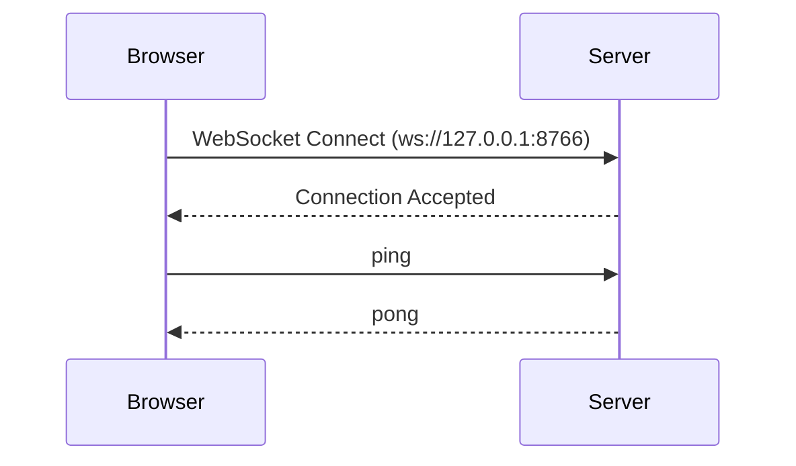
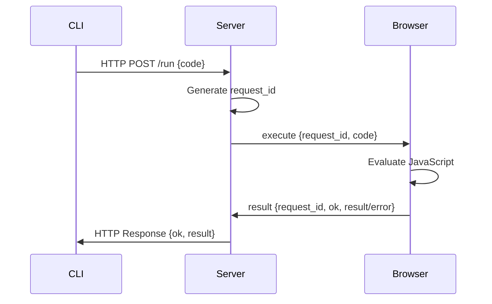
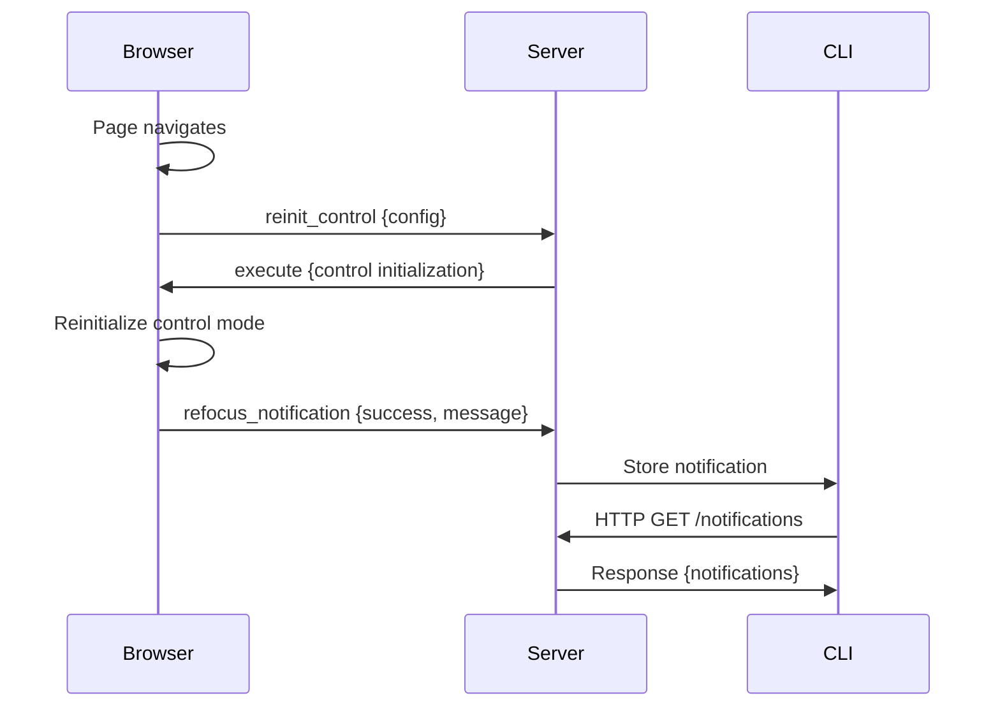
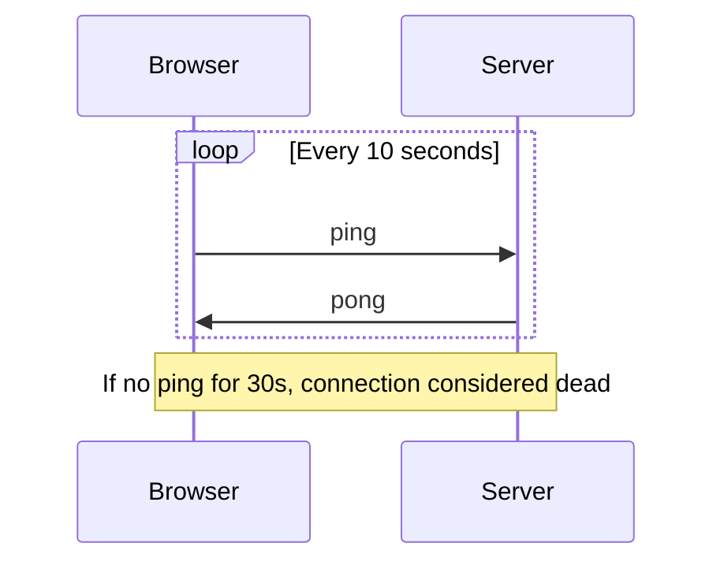

# WebSocket Protocol Specification

Complete specification for the Inspekt WebSocket protocol.

---

## Overview

Inspekt uses a bidirectional WebSocket protocol for real-time communication between the Python server and browser userscript. The protocol supports:

- **Code Execution**: Execute JavaScript in browser from server
- **Keepalive**: Ping/pong for connection health
- **Control Mode**: Interactive keyboard navigation
- **Notifications**: Asynchronous events from browser

**Protocol Version:** 1.0  
**WebSocket Path:** `ws://127.0.0.1:8766`  
**HTTP API:** `http://127.0.0.1:8765`

---

## Connection Lifecycle

### 1. Connection Establishment



**Steps:**

1. Browser userscript connects to `ws://127.0.0.1:8766`
2. Server accepts WebSocket connection
3. Browser sends periodic ping messages
4. Server responds with pong messages

### 2. Active Communication

Once connected, both sides can send messages at any time:

- Server sends `execute` requests
- Browser sends `result` responses
- Browser sends `reinit_control` requests
- Browser sends `refocus_notification` events
- Browser sends `ping` keepalives
- Server sends `pong` responses

### 3. Connection Termination

Connection closes when:

- Browser tab/window closes
- Server shuts down
- Connection error occurs
- Keepalive timeout (no ping for 30+ seconds)

---

## Message Types

### Direction: Server → Browser

#### execute

Execute JavaScript code in the browser.

**Format:**
```json
{
  "type": "execute",
  "request_id": "550e8400-e29b-41d4-a716-446655440000",
  "code": "document.title"
}
```

**Fields:**

- `type`: Always "execute"
- `request_id`: UUID v4 for request tracking
- `code`: JavaScript code to evaluate

**Response:** Browser sends `result` message

---

#### pong

Keepalive response to ping.

**Format:**
```json
{
  "type": "pong"
}
```

**Fields:**

- `type`: Always "pong"

**Trigger:** Sent in response to `ping` from browser

---

### Direction: Browser → Server

#### result

Result of JavaScript code execution.

**Format (Success):**
```json
{
  "type": "result",
  "request_id": "550e8400-e29b-41d4-a716-446655440000",
  "ok": true,
  "result": "Example Domain",
  "url": "https://example.com",
  "title": "Example Domain"
}
```

**Format (Error):**
```json
{
  "type": "result",
  "request_id": "550e8400-e29b-41d4-a716-446655440000",
  "ok": false,
  "error": "ReferenceError: foo is not defined"
}
```

**Fields:**

- `type`: Always "result"
- `request_id`: UUID matching the execute request
- `ok`: true if execution succeeded, false otherwise
- `result`: Return value (present if ok=true)
- `error`: Error message (present if ok=false)
- `url`: Current page URL (optional)
- `title`: Current page title (optional)

**Additional Fields:** Browser may include extra fields

---

#### reinit_control

Request to reinitialize control mode after page reload.

**Format:**
```json
{
  "type": "reinit_control",
  "config": {
    "auto-refocus": "only-spa",
    "speak-name": false,
    "verbose": true
  }
}
```

**Fields:**

- `type`: Always "reinit_control"
- `config`: Control mode configuration object

**Purpose:** Sent when browser detects page reload and needs control mode reinitialized

---

#### refocus_notification

Notification of refocus operation result.

**Format:**
```json
{
  "type": "refocus_notification",
  "success": true,
  "message": "Refocused to first interactive element"
}
```

**Fields:**

- `type`: Always "refocus_notification"
- `success`: Whether refocus succeeded
- `message`: Human-readable status message

**Purpose:** Asynchronous notification of refocus events (not tied to a specific request)

---

#### ping

Keepalive message.

**Format:**
```json
{
  "type": "ping"
}
```

**Fields:**

- `type`: Always "ping"

**Response:** Server sends `pong` message

**Frequency:** Sent every 10 seconds by browser

---

## Request/Response Patterns

### Execute Pattern

Standard synchronous request/response:



**Timeline:**

1. CLI makes HTTP request to server
2. Server generates unique request_id
3. Server sends execute message to browser via WebSocket
4. Browser evaluates JavaScript code
5. Browser sends result message back to server
6. Server returns result to CLI via HTTP response

**Timeout:** Configurable (default: 10 seconds)

---

### Notification Flow

Asynchronous notifications from browser:



**Flow:**

1. Browser detects event (navigation, refocus, etc.)
2. Browser sends notification to server
3. Server stores notification
4. CLI polls /notifications endpoint
5. Server returns stored notifications
6. Notifications cleared after retrieval

---

### Keepalive Pattern

Connection health monitoring:



**Parameters:**

- Ping interval: 10 seconds
- Timeout threshold: 30 seconds
- Action on timeout: Close connection

---

## Error Handling

### Connection Errors

**Error:** WebSocket connection fails

**Behavior:**

- Browser userscript logs error to console
- Server marks connection as closed
- CLI commands fail with "Server not running" error

**Recovery:**

- Browser: Retry connection (exponential backoff)
- CLI: User must start server with `inspekt server start`

---

### Execution Errors

**Error:** JavaScript execution throws exception

**Behavior:**

- Browser catches exception
- Browser sends result with `ok: false` and `error` message
- Server returns error to CLI
- CLI exits with code 1

**Example:**

```json
{
  "type": "result",
  "request_id": "550e8400-e29b-41d4-a716-446655440000",
  "ok": false,
  "error": "TypeError: Cannot read property 'foo' of undefined"
}
```

---

### Timeout Errors

**Error:** No response received within timeout

**Behavior:**

- Server waits for configured timeout (default: 10s)
- If no response, server returns timeout error
- CLI can optionally retry with exponential backoff

**Mitigation:**

- Increase timeout for slow operations
- Enable retry with `retry_on_timeout=True`

---

### Version Mismatch

**Error:** Userscript version doesn't match server version

**Behavior:**

- Server checks version on first execute
- If mismatch, prints warning to CLI
- Execution continues (non-fatal)

**Resolution:**

- Update userscript to match server version
- Or update server to match userscript version

---

## Version Negotiation

**Current Version:** 1.0 (implicit)

**Future:** Version field may be added to messages:

```json
{
  "type": "execute",
  "version": "2.0",
  "request_id": "...",
  "code": "..."
}
```

**Compatibility:**

- Current protocol has no explicit versioning
- Version mismatch detected via userscript metadata
- Non-breaking changes allowed in minor versions
- Breaking changes require major version bump

---

## Code Examples

### Python Server (Sending Execute Request)

```python
import uuid
import json
from zen.domain.models import create_execute_request

# Create request
request_id = str(uuid.uuid4())
request = create_execute_request(
    request_id=request_id,
    code="document.title"
)

# Serialize to JSON
message = request.model_dump_json()

# Send via WebSocket
await websocket.send(message)

# Wait for response
response_data = await websocket.recv()
response_dict = json.loads(response_data)

# Parse response
from zen.domain.models import parse_incoming_message
result = parse_incoming_message(response_dict)

if result.type == "result":
    if result.ok:
        print(f"Success: {result.result}")
    else:
        print(f"Error: {result.error}")
```

---

### JavaScript Browser (Receiving Execute Request)

```javascript
// WebSocket connection
const ws = new WebSocket('ws://127.0.0.1:8766');

ws.onmessage = async (event) => {
  const message = JSON.parse(event.data);
  
  if (message.type === 'execute') {
    try {
      // Evaluate JavaScript code
      const result = await eval(message.code);
      
      // Send success response
      ws.send(JSON.stringify({
        type: 'result',
        request_id: message.request_id,
        ok: true,
        result: result,
        url: location.href,
        title: document.title
      }));
      
    } catch (error) {
      // Send error response
      ws.send(JSON.stringify({
        type: 'result',
        request_id: message.request_id,
        ok: false,
        error: error.toString()
      }));
    }
  }
  
  else if (message.type === 'pong') {
    // Keepalive acknowledged
    console.log('Pong received');
  }
};

// Send ping every 10 seconds
setInterval(() => {
  ws.send(JSON.stringify({ type: 'ping' }));
}, 10000);
```

---

### JavaScript Browser (Sending Notification)

```javascript
// Detect page navigation
window.addEventListener('load', () => {
  // Request control mode reinitialization
  ws.send(JSON.stringify({
    type: 'reinit_control',
    config: {
      'auto-refocus': 'only-spa',
      'speak-name': false,
      'verbose': true
    }
  }));
});

// Send refocus notification
function notifyRefocus(success, message) {
  ws.send(JSON.stringify({
    type: 'refocus_notification',
    success: success,
    message: message
  }));
}
```

---

## HTTP API Integration

While WebSocket handles real-time communication, HTTP API provides REST interface:

### POST /run

Submit code for execution.

**Request:**
```json
{
  "code": "document.title"
}
```

**Response:**
```json
{
  "ok": true,
  "request_id": "550e8400-e29b-41d4-a716-446655440000"
}
```

---

### GET /result?request_id=<id>

Retrieve execution result.

**Response (Pending):**
```json
{
  "ok": false,
  "status": "pending"
}
```

**Response (Complete):**
```json
{
  "ok": true,
  "result": "Example Domain",
  "url": "https://example.com",
  "title": "Example Domain"
}
```

---

### GET /health

Check server health.

**Response:**
```json
{
  "ok": true,
  "timestamp": 1698765432.123,
  "connected_browsers": 1,
  "pending": 0,
  "completed": 142
}
```

---

### GET /notifications

Retrieve pending notifications.

**Response:**
```json
{
  "ok": true,
  "notifications": [
    {
      "type": "refocus",
      "success": true,
      "message": "Refocused to first interactive element",
      "timestamp": 1698765432.123
    }
  ]
}
```

---

### POST /reinit-control

Request control mode reinitialization.

**Request:**
```json
{
  "config": {
    "auto-refocus": "always",
    "speak-name": true
  }
}
```

**Response:**
```json
{
  "ok": true
}
```

---

## Security Considerations

### Origin Validation

**Current:** No origin validation (localhost only)

**Future:** Add CORS headers, origin whitelist

### Authentication

**Current:** No authentication (local use only)

**Future:** Token-based auth for remote access

### Code Injection

**Risk:** Arbitrary JavaScript execution

**Mitigation:**

- Protocol designed for trusted local use
- User controls what code is executed
- Userscript runs in browser sandbox

### Rate Limiting

**Current:** No rate limiting

**Future:** Request throttling, queue limits

---

## Performance Characteristics

### Latency

- **Local WebSocket:** <5ms round-trip
- **Execute request:** 5-50ms depending on code complexity
- **HTTP polling:** 10-100ms

### Throughput

- **Max concurrent requests:** Unlimited (queued)
- **Max message size:** 1MB (configurable)
- **Keepalive overhead:** 12 bytes every 10 seconds

### Scalability

- **Connections per server:** 1 (single browser)
- **Requests per second:** Hundreds (limited by JavaScript execution)
- **Queue depth:** Unlimited (memory-bound)

---

## Debugging

### Enable Verbose Logging

Server side:
```python
import logging
logging.basicConfig(level=logging.DEBUG)
```

Browser side:
```javascript
// Set verbose-logging: true in config.json
```

### Monitor WebSocket Traffic

Browser DevTools → Network → WS → Messages tab

### Inspect Protocol Messages

```python
# In server code
import json
print(f"Sending: {json.dumps(message, indent=2)}")
print(f"Received: {json.dumps(response, indent=2)}")
```

---

## See Also

- [Commands Reference](commands.md)
- [Services Reference](services.md)
- [Models Reference](models.md)
- [Architecture Guide](../development/architecture.md)
- [WebSocket RFC](https://datatracker.ietf.org/doc/html/rfc6455)
