# Architecture

Zen Bridge follows a modern **4-layer architecture** with clear separation of concerns, strong type safety, and async-first design principles.

## Overview

Zen Bridge bridges the gap between terminal workflows and browser automation, enabling JavaScript execution in the browser from the command line.

### Key Principles

1. **Layered Architecture** - Clean separation between domain, I/O, services, and application
2. **Type Safety First** - Pydantic models for all data with automatic validation
3. **Async by Design** - Non-blocking I/O throughout the WebSocket server
4. **Single Responsibility** - Each module has one clear purpose
5. **Testability** - Dependency injection and adapter patterns

## System Architecture


## 4-Layer Architecture

Here's a detailed view of how the layers interact:


### Layer 0: Domain (Core)

**Pure data structures and validation logic** - No I/O or external dependencies.

**Location**: `zen/domain/`

**Components**:

- `models.py` (398 lines) - Pydantic models for all data structures
  - WebSocket messages (8 types)
  - HTTP API models (7 types)
  - Configuration models (2 types)
  - Helper functions

**Example**:

```python
from zen.domain.models import ExecuteRequest, ExecuteResult

# Create validated request
request = ExecuteRequest(
    request_id="abc-123",
    code="document.title"
)

# Parse incoming message
result = ExecuteResult(
    request_id="abc-123",
    ok=True,
    result="Example Domain"
)
```

**Properties**:

- ✅ No I/O operations
- ✅ Pure validation logic
- ✅ 94.70% test coverage
- ✅ Type-safe with Pydantic

### Layer 1: Adapters (I/O)

**Abstraction for external systems** - Filesystem, network, etc.

**Location**: `zen/adapters/`

**Components**:

- `filesystem.py` (176 lines) - File operations
  - Async methods: `read_text_async()`, `write_text_async()`
  - Sync methods: `read_text_sync()`, `write_text_sync()`
  - Utilities: `file_exists()`, `dir_exists()`

**Example**:

```python
from zen.adapters import filesystem

# Async (in server)
content = await filesystem.read_text_async(script_path)

# Sync (in CLI)
config = filesystem.read_text_sync(config_path)
```

**Benefits**:

- ✅ Prevents blocking I/O in async code
- ✅ Easy to mock for testing
- ✅ Consistent interface

### Layer 2: Services (Business Logic)

**Orchestration and business logic** - Coordinates between layers.

**Location**: `zen/services/`

**Components**:

1. **ScriptLoader** (207 lines)
   - Load JavaScript files from `zen/scripts/`
   - In-memory caching
   - Template substitution
   - Sync & async interfaces

2. **BridgeExecutor** (263 lines)
   - Standardized code execution
   - Retry logic with exponential backoff
   - Error handling
   - Version checking

3. **AIIntegration** (367 lines)
   - Language detection
   - Prompt loading and formatting
   - Integration with 'mods' AI tool

4. **ControlManager** (230 lines)
   - Control mode state tracking
   - Notification polling
   - Accessibility announcements (TTS)

**Service Interactions**:


**Example**:

```python
from zen.services.bridge_executor import get_executor

executor = get_executor()
result = executor.execute(
    "document.title",
    timeout=10.0,
    retry_on_timeout=True
)
```

### Layer 3: Application

**User-facing interfaces** - CLI and WebSocket server.

**Location**: `zen/app/`

**Components**:

**CLI Modules** (12 modules, 4,220 lines):

| Module | Commands | Purpose |
|--------|----------|---------|
| `exec.py` | eval, exec, repl | JavaScript execution |
| `extraction.py` | extract-* | Data extraction |
| `inspection.py` | info, inspect | Page inspection |
| `interaction.py` | click, type | Element interaction |
| `navigation.py` | open, back | Navigation |
| `server.py` | server | Server management |
| `watch.py` | watch | Event monitoring |
| `cookies.py` | cookies | Cookie management |

**WebSocket Server** (`bridge_ws.py`, 396 lines):

- HTTP endpoints: `/run`, `/result`, `/health`, `/notifications`
- WebSocket handler: `/ws`
- Request/response state management

## Data Flow

### Command Execution Flow


**Timing** (typical):

- CLI → Server: ~1-5ms
- Server → Browser: ~1-5ms
- Browser eval: 1-100ms (depends on code)
- Total: **5-120ms** end-to-end

### Script Loading Flow


**Performance**:

- First load: ~50ms (disk I/O)
- Cached: ~0.1ms (memory)
- **Result**: 50-100ms saved per command

### WebSocket Communication Flow


## Extension Points

### Adding a New CLI Command

1. **Choose/create module** in `zen/app/cli/`
2. **Define command**:

```python
import click
from zen.services.bridge_executor import get_executor

@click.command()
@click.argument("selector")
def my_command(selector):
    """My awesome command."""
    executor = get_executor()

    # Execute JavaScript
    result = executor.execute(
        f"document.querySelector('{selector}').textContent"
    )

    click.echo(result["result"])
```

3. **Register in main CLI** (`zen/app/cli/__init__.py`)

### Adding a New Service

1. **Create service class** in `zen/services/`
2. **Implement singleton pattern**:

```python
from __future__ import annotations

class MyService:
    def __init__(self):
        pass

    def do_something(self, input: str) -> str:
        return f"Processed: {input}"

_default_service: MyService | None = None

def get_my_service() -> MyService:
    global _default_service
    if _default_service is None:
        _default_service = MyService()
    return _default_service
```

### Extending the Protocol

1. **Add Pydantic model** in `zen/domain/models.py`:

```python
class MyNewMessage(BaseModel):
    type: Literal["my_new_message"] = "my_new_message"
    data: str
    timestamp: float
```

2. **Update parser**:

```python
def parse_incoming_message(data: dict[str, Any]) -> IncomingMessage:
    if data.get("type") == "my_new_message":
        return MyNewMessage(**data)
    # ...
```

3. **Handle in server** (`bridge_ws.py`)

## Design Patterns

### Service Layer Pattern

Services coordinate business logic between adapters and application:

```python
class BridgeExecutor:
    def execute(self, code: str, timeout: float) -> dict:
        # 1. Check server
        self.ensure_server_running()

        # 2. Execute with retry
        for attempt in range(self.max_retries):
            result = self.client.execute(code, timeout)
            if result["ok"]:
                return result

        # 3. Handle failure
        raise ExecutionError()
```

### Adapter Pattern

Adapters abstract I/O operations for testability:

```python
# Production
content = await filesystem.read_text_async(path)

# Testing
@pytest.fixture
def mock_filesystem(monkeypatch):
    async def mock_read(path):
        return "mocked content"
    monkeypatch.setattr(filesystem, "read_text_async", mock_read)
```

### Singleton Pattern

Share expensive resources across commands:

```python
_default_executor: BridgeExecutor | None = None

def get_executor() -> BridgeExecutor:
    global _default_executor
    if _default_executor is None:
        _default_executor = BridgeExecutor()
    return _default_executor
```

### Repository Pattern

Centralize script access with caching:

```python
loader = ScriptLoader()
script = loader.load_script_sync("control.js")  # Cached automatically
```

## Module Dependencies

```mermaid
graph TD
    App[Application Layer] --> Services[Services Layer]
    Services --> Adapters[Adapters Layer]
    Services --> Domain[Domain Layer]
    Adapters --> Domain

    App -.->|❌ Never| Domain
    Services -.->|❌ Never| App
    Adapters -.->|❌ Never| Services
    Adapters -.->|❌ Never| App
    Domain -.->|❌ Never| Any[Any Layer]

    style Domain fill:#e1ffe1
    style Adapters fill:#ffe1f5
    style Services fill:#fff4e1
    style App fill:#e1f5ff
```



**Rules**:

- ✅ Higher layers import lower layers
- ❌ Lower layers never import higher
- ✅ No circular dependencies
- 📋 To be enforced with ruff (Phase 3)

## Configuration

### Hierarchy (highest to lowest priority)

1. **CLI flags** - `--timeout 30`
2. **Environment variables** - `export ZEN_TIMEOUT=30` (planned)
3. **Local config** - `./config.json`
4. **User config** - `~/.zen/config.json`
5. **Defaults** - `zen/config.py:DEFAULT_CONFIG`

### Configuration Model

```python
class ZenConfig(BaseModel):
    ai_language: str = "auto"
    control: ControlConfig = Field(default_factory=ControlConfig)
```

**Example config**:

```json
{
  "ai-language": "nl",
  "control": {
    "auto-refocus": "always",
    "speak-all": true,
    "verbose": true,
    "focus-color": "#ff6600"
  }
}
```

## Performance

### Metrics

- **Command latency**: 5-120ms (typical)
- **Script cache hit**: ~0.1ms (vs ~50ms disk)
- **Event loop**: Non-blocking (async I/O throughout)

### Optimizations

1. **Script caching** - In-memory cache for frequently used scripts
2. **Singleton services** - Reuse HTTP clients and connections
3. **Async I/O** - Non-blocking file operations in server
4. **Connection pooling** - Reuse WebSocket connections

## Security

!!! warning "Localhost Only"
    Server binds to `127.0.0.1` **only**. Never bind to `0.0.0.0` or public IPs.

### Security Model

- **Localhost-only**: All communication on loopback interface
- **No authentication**: Trust model for local development
- **User must trust scripts**: Arbitrary JavaScript execution by design
- **Browser sandbox**: Relies on browser security boundaries

See [Security Guide](security.md) for detailed threat model.

## Technology Stack

### Core

- **Python 3.11+** - Modern async/await
- **Click 8.1+** - CLI framework
- **aiohttp 3.9+** - Async HTTP/WebSocket
- **Pydantic 2.5+** - Data validation
- **aiofiles 23.2+** - Async file I/O

### Development

- **pytest** - Testing framework
- **mypy** - Static type checking
- **ruff** - Fast linting and formatting
- **pre-commit** - Git hooks

### Browser

- **WebSocket API** - Bidirectional communication
- **Tampermonkey/Violentmonkey** - Userscript injection
- **JavaScript ES6+** - Client-side execution

## Project Metrics

**Code Metrics** (Phase 0-2):

- Total Python: ~5,550 lines
- Main modules: 23 files
- Test coverage: 11.83% (target: 80%+)
- Type coverage: 100% on new code
- Tests: 52 passing

**CI/CD**:

- Python 3.11, 3.12, 3.13
- Lint, typecheck, test on push
- Pre-commit hooks

## Next Steps

- [Contributing Guide](contributing.md) - Development workflow
- [Testing Guide](testing.md) - Test strategy
- [Security Guide](security.md) - Security model

## References

- [ARCHITECTURE.md](../../ARCHITECTURE.md) - Complete architecture doc
- [REFACTOR_PLAN.md](../../REFACTOR_PLAN.md) - Refactoring progress
- [PROTOCOL.md](../../PROTOCOL.md) - WebSocket protocol spec
