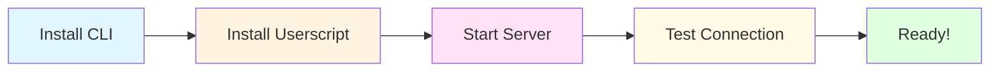

# Installation

This comprehensive guide will walk you through installing Inspekt on your system, from installing Python dependencies to setting up the browser userscript and verifying everything works correctly.

## Installation Flow



---

## Requirements

Before you begin, ensure you have the following:

- **Python 3.11 or higher** - Check your version with `python --version` or `python3 --version`
- **pip** - Python package manager (usually included with Python)
- **A modern browser** - Chrome, Firefox, Edge, Safari, or any Chromium-based browser
- **A userscript manager extension** - We'll install this in the browser setup step

!!! tip "Python Version Check"
    Run `python3 --version` to check your Python version. If you have Python 3.10 or lower, you'll need to upgrade to Python 3.11 or higher.

    === "macOS"
        ```bash
        # Using Homebrew
        brew install python@3.11
        ```

    === "Ubuntu/Debian"
        ```bash
        sudo apt update
        sudo apt install python3.11 python3.11-pip
        ```

    === "Windows"
        Download from [python.org](https://www.python.org/downloads/) and install Python 3.11+

---

## Step 1: Install the CLI Tool

You can install Inspekt from source (recommended for development) or via pip (when available).

=== "From Source (Recommended)"

    Clone the repository and install in development mode:

    ```bash
    # Clone the repository
    git clone https://github.com/roelvangils/inspekt.git
    cd inspekt

    # Install in development mode
    pip install -e .
    ```

    This installs the `zen` command and all dependencies. The `-e` flag means "editable" - changes to the source code will be reflected immediately.

=== "Install Dependencies Manually"

    If you prefer to manage dependencies yourself:

    ```bash
    # Clone the repository
    git clone https://github.com/roelvangils/inspekt.git
    cd inspekt

    # Install dependencies
    pip install -r requirements.txt
    ```

=== "For Development"

    If you plan to contribute or run tests:

    ```bash
    # Clone the repository
    git clone https://github.com/roelvangils/inspekt.git
    cd inspekt

    # Install with dev dependencies
    pip install -e ".[dev]"
    ```

    This includes testing tools (pytest, playwright), linters (ruff), and type checkers (mypy).

### Verify the Installation

After installation, verify the `zen` command is available:

```bash
inspekt--version
```

You should see output like:

```
Inspekt v2.0.0
```

Run the help command to see available commands:

```bash
inspekt--help
```

!!! success "Installation Complete"
    The CLI tool is now installed! Next, we'll set up the browser connection.

---

## Step 2: Install the Browser Component

The browser needs a component to receive commands from the CLI and establish a WebSocket connection to the server.

**Choose one installation method:**

- **[Extension (Recommended)](#extension-installation)** - Works on ALL websites including GitHub, Gmail, banking sites. Bypasses CSP restrictions.
- **[Userscript (Quick Setup)](#userscript-installation)** - One-click installation, but may be blocked by CSP on some sites.

### Extension Installation

The Firefox extension provides **full compatibility** with all websites, including those with strict Content Security Policy (CSP) like GitHub, Gmail, and banking sites.

#### 2.1a Install Firefox Extension

1. **Download the extension files** from the repository:
   ```bash
   cd /path/to/inspekt
   cd extensions/firefox
   ```

2. **Open Firefox** and navigate to:
   ```
   about:debugging#/runtime/this-firefox
   ```

3. **Load the extension**:
   - Click "Load Temporary Add-on..."
   - Select the `manifest.json` file from `extensions/firefox/`

4. **Verify installation**:
   - Look for the ⚡ icon in your toolbar
   - Click it to see the status panel

!!! success "Extension Installed"
    The extension will now work on all websites! Continue to [Step 3: Start the Bridge Server](#step-3-start-the-bridge-server).

!!! tip "Why Use the Extension?"
    The extension bypasses Content Security Policy (CSP) restrictions that block the userscript on important sites:

    - ✅ Works on GitHub, Gmail, banking sites
    - ✅ Built-in settings panel with connection status
    - ✅ No CSP limitations

    [Read more about extensions →](../../extensions/)

### Userscript Installation

The userscript is quick to install but may be blocked by CSP on some websites. If you encounter issues on GitHub, Gmail, or banking sites, use the [extension instead](#extension-installation).

#### 2.1b Install a Userscript Manager

First, install a userscript manager extension in your browser:

=== "Violentmonkey (Recommended)"

    **Best compatibility and open source.**

    - [Chrome/Edge](https://chrome.google.com/webstore/detail/violent-monkey/jinjaccalgkegednnccohejagnlnfdag)
    - [Firefox](https://addons.mozilla.org/firefox/addon/violentmonkey/)
    - [Safari](https://apps.apple.com/app/userscripts/id1463298887)

=== "Tampermonkey"

    **Popular alternative with many features.**

    - [Chrome/Edge](https://chrome.google.com/webstore/detail/tampermonkey/dhdgffkkebhmkfjojejmpbldmpobfkfo)
    - [Firefox](https://addons.mozilla.org/firefox/addon/tampermonkey/)
    - [Safari](https://apps.apple.com/app/tampermonkey/id1482490089)

=== "Greasemonkey (Firefox only)"

    **Classic Firefox userscript manager.**

    - [Firefox](https://addons.mozilla.org/firefox/addon/greasemonkey/)

!!! note "Browser Compatibility"
    Zen Bridge works with any browser that supports userscript managers and WebSockets. This includes all modern browsers.

!!! warning "CSP Limitations"
    The userscript may be blocked by Content Security Policy on sites like:

    - GitHub, GitLab
    - Gmail, Outlook
    - Banking and government sites

    If you encounter CSP issues, use the [Firefox extension](#extension-installation) instead for full compatibility.

    [Read CSP troubleshooting guide →](../troubleshooting/csp-issues/)

#### 2.2b Get the Userscript Code

Display the userscript code using the CLI:

```bash
inspektuserscript
```

This will output the complete userscript code to your terminal. The userscript is located at `/Users/roelvangils/zen_bridge/userscript_ws.js` in the repository.

#### 2.3b Create the Userscript

Now create a new userscript in your userscript manager:

1. **Click the userscript manager icon** in your browser toolbar
2. **Create a new script** (usually a "+" or "New Script" button)
3. **Delete any default content** in the editor
4. **Paste the userscript code** from the `inspektuserscript` command
5. **Save the script** (usually ++ctrl+s++ or ++cmd+s++)

The userscript will automatically enable itself.

!!! tip "Quick Copy"
    To copy the userscript to your clipboard (macOS):
    ```bash
    inspektuserscript | pbcopy
    ```

    Or save it to a file:
    ```bash
    inspektuserscript > my-userscript.js
    ```

#### 2.4b Verify Userscript is Active

To verify the userscript is running:

1. Open your browser's **Developer Console** (++f12++ or ++cmd+opt+i++)
2. Look for a message like: **"Zen Bridge userscript loaded"**
3. Check that the userscript manager shows the script as **enabled**

!!! warning "Userscript Scope"
    By default, the userscript runs on **all pages** (`@match *://*/*`). If you want to restrict it to specific domains, edit the `@match` line in the userscript.

---

## Step 3: Start the Bridge Server

The bridge server acts as a middleman between the CLI and browser, managing WebSocket connections and HTTP endpoints.

### 3.1 Start the Server

You can start the server in foreground or background mode:

=== "Background Mode (Daemon)"

    **Recommended for normal use:**

    ```bash
    inspektserver start --daemon
    ```

    The server runs in the background. You can close your terminal and it will keep running.

    Check server status:
    ```bash
    inspektserver status
    ```

    Stop the server:
    ```bash
    inspektserver stop
    ```

=== "Foreground Mode"

    **Useful for debugging:**

    ```bash
    inspektserver start
    ```

    The server runs in the foreground with live log output. Press ++ctrl+c++ to stop.

    Example output:
    ```
    Starting Zen Bridge WebSocket server...
    HTTP API server: http://127.0.0.1:8765
    WebSocket server: ws://127.0.0.1:8766
    Server is ready! Waiting for browser connections...
    ```

### 3.2 Server Ports

The server uses two ports:

- **HTTP API**: `http://127.0.0.1:8765` - CLI communicates with this
- **WebSocket**: `ws://127.0.0.1:8766` - Browser connects to this

!!! note "Port Configuration"
    The ports are currently hardcoded. If you need to change them, you'll need to modify the server configuration and userscript.

### 3.3 Verify Server is Running

Check the server status:

```bash
inspektserver status
```

Expected output when running:

```
✓ Server is running
  PID: 12345
  HTTP API: http://127.0.0.1:8765
  WebSocket: ws://127.0.0.1:8766
  Connected browsers: 0
  Uptime: 2 minutes
```

---

## Step 4: Verify the Complete Setup

Now let's verify that everything is working together:

### 4.1 Open a Browser Tab

1. Open your browser (with the userscript manager and userscript installed)
2. Navigate to any website, for example: [https://example.com](https://example.com)
3. Keep the tab active (the userscript only works in active tabs)

### 4.2 Check Browser Connection

In the browser's Developer Console (++f12++), you should see:

```
Zen Bridge userscript loaded
Connected to Zen Bridge WebSocket server
```

### 4.3 Execute a Test Command

From your terminal, run a simple command:

```bash
inspekteval "document.title"
```

Expected output:

```
Example Domain
```

If you see the page title, congratulations! Everything is working correctly.

!!! success "Connection Successful!"
    Your terminal is now connected to your browser. You can execute JavaScript directly in the active tab!

### 4.4 Try More Commands

```bash
# Get page information
inspektinfo

# Get the current URL
inspekteval "location.href"

# Count links on the page
inspekteval "document.querySelectorAll('a').length"

# Start interactive REPL
inspektrepl
```

!!! success "Setup Complete!"
    You've successfully installed Inspekt! Check out the [Quick Start Guide](quick-start.md) for a hands-on tutorial.

---

## Troubleshooting

### "zen: command not found"

**Problem**: The `zen` command is not in your PATH.

**Solutions**:

=== "Check Installation"
    ```bash
    # Verify installation
    pip show inspekt

    # Reinstall if needed
    pip install -e .
    ```

=== "Update PATH"
    ```bash
    # Find where pip installs scripts
    python3 -m site --user-base

    # Add to PATH (add to ~/.bashrc or ~/.zshrc)
    export PATH="$PATH:$(python3 -m site --user-base)/bin"
    ```

=== "Use python -m"
    ```bash
    # Run as a module instead
    python3 -m zen.cli --help
    ```

### "Bridge server is not running"

**Problem**: The CLI cannot connect to the server.

**Solutions**:

1. **Start the server**:
   ```bash
   inspektserver start --daemon
   ```

2. **Check if server is running**:
   ```bash
   inspektserver status
   ```

3. **Restart the server**:
   ```bash
   inspektserver stop
   inspektserver start --daemon
   ```

4. **Check for port conflicts**:
   ```bash
   # Check if ports 8765 or 8766 are in use
   lsof -i :8765
   lsof -i :8766
   ```

### "No response from browser"

**Problem**: The browser is not connected to the WebSocket server.

**Solutions**:

1. **Verify userscript is installed and enabled**
   - Check userscript manager icon
   - Ensure script is enabled

2. **Check browser console for errors**
   - Open DevTools (++f12++)
   - Look for WebSocket connection errors
   - Ensure you see "Connected to Zen Bridge WebSocket server"

3. **Ensure tab is active**
   - The userscript only works in the currently active browser tab
   - Switch to the tab and try again

4. **Restart everything**:
   ```bash
   # Stop server
   inspektserver stop

   # Restart browser (to reload userscript)

   # Start server
   inspektserver start --daemon
   ```

5. **Check WebSocket connection manually**
   - In browser console, run:
     ```javascript
     ws = new WebSocket('ws://127.0.0.1:8766')
     ws.onopen = () => console.log('Connected!')
     ```

### Command Timeout

**Problem**: Commands hang or timeout.

**Solutions**:

1. **Increase timeout**:
   ```bash
   inspekteval "slow_operation()" --timeout 30
   ```

2. **Check if tab is active**:
   - Inactive tabs may throttle JavaScript execution
   - Switch to the tab and try again

3. **Check for JavaScript errors**:
   - Open browser console
   - Look for errors when command executes

### WebSocket Connection Refused

**Problem**: Browser cannot connect to WebSocket server.

**Solutions**:

1. **Verify server is running**:
   ```bash
   inspektserver status
   ```

2. **Check firewall settings**:
   - Ensure localhost connections are allowed
   - Port 8766 must be accessible

3. **Try a different port** (requires code modification):
   - Edit server configuration
   - Update userscript to match

### Python Version Issues

**Problem**: Zen Bridge requires Python 3.11+, but you have an older version.

**Solution**: Upgrade Python:

=== "macOS (Homebrew)"
    ```bash
    brew install python@3.11
    # Update PATH in ~/.zshrc or ~/.bashrc
    export PATH="/usr/local/opt/python@3.11/bin:$PATH"
    ```

=== "Ubuntu/Debian"
    ```bash
    sudo apt update
    sudo apt install python3.11 python3.11-pip
    # Use python3.11 explicitly
    python3.11 -m pip install -e .
    ```

=== "Windows"
    Download and install from [python.org](https://www.python.org/downloads/)

---

## Uninstallation

To uninstall Inspekt:

### 1. Stop the Server

```bash
inspektserver stop
```

### 2. Uninstall the Package

```bash
# If installed with pip
pip uninstall inspekt

# If installed from source, just delete the directory
rm -rf ~/inspekt
```

### 3. Remove Browser Userscript

1. Click userscript manager icon
2. Find "Zen Bridge" script
3. Delete or disable the script

---

## Next Steps

Now that you have Inspekt installed, continue with:

- **[Quick Start Guide](quick-start.md)** - 5-minute hands-on tutorial
- **[Configuration](configuration.md)** - Customize your setup
- **[User Guide](../guide/overview.md)** - Learn all commands and features

---

## Additional Resources

- **[GitHub Repository](https://github.com/roelvangils/inspekt)** - Source code and issues
- **[Architecture Guide](../development/architecture.md)** - How Zen Bridge works internally
- **[Security Guide](../development/security.md)** - Security model and best practices
