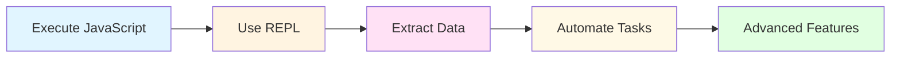

# Quick Start

Get up and running with Inspekt in just 5 minutes! This hands-on tutorial will walk you through the basics and show you the power of browser automation from the command line.

!!! note "Prerequisites"
    Make sure you've completed the [Installation](installation.md) guide before starting this tutorial.

## Quick Start Workflow

Here's what we'll cover in this tutorial:



---

## Your First Commands

### Step 1: Navigate to a Test Page

Open your browser and navigate to [https://example.com](https://example.com). Keep this tab active.

### Step 2: Execute JavaScript

Run your first command to get the page title:

```bash
inspekteval "document.title"
```

Expected output:

```
Example Domain
```

Congratulations! You just executed JavaScript in your browser from the terminal.

### Step 3: Try More Expressions

```bash
# Get the current URL
inspekteval "location.href"
# => https://example.com/

# Count paragraphs on the page
inspekteval "document.querySelectorAll('p').length"
# => 2

# Get all link URLs
inspekteval "Array.from(document.links).map(a => a.href)"
# => ["https://www.iana.org/domains/example"]
```

!!! tip "Quick Tip"
    The `inspekteval` command evaluates JavaScript expressions. For more complex code, use `inspektexec` with a file.

---

## Interactive REPL Session

The REPL (Read-Eval-Print Loop) lets you experiment with JavaScript interactively:

```bash
inspektrepl
```

Try these commands in the REPL:

```javascript
// Get the page title
zen> document.title
"Example Domain"

// Query the DOM
zen> document.querySelectorAll('h1')[0].textContent
"Example Domain"

// Create an array of links
zen> Array.from(document.links).map(a => ({text: a.textContent, href: a.href}))
[{text: "More information...", href: "https://www.iana.org/domains/example"}]

// Exit the REPL
zen> exit
Goodbye!
```

!!! success "REPL Power"
    The REPL is perfect for exploring APIs, debugging, and prototyping JavaScript code before adding it to scripts.

---

## Extract Page Information

Use the `info` command to get comprehensive page details:

```bash
inspektinfo
```

Example output:

```
URL:      https://example.com
Title:    Example Domain
Domain:   example.com
Protocol: https:
State:    complete
Size:     1280x720
```

For extended information including language, meta tags, and cookies:

```bash
inspektinfo --extended
```

---

## Working with Links

Navigate to a page with more links (like a news site or blog), then:

### List All Links

```bash
inspektlinks
```

Example output:

```
→ Home Page
  https://example.com/

→ About Us
  https://example.com/about

↗ External Resource
  https://other-site.com/page

Total: 15 links (12 internal, 3 external)
```

### Extract External Links Only

```bash
inspektlinks --only-external --only-urls
```

This outputs just the URLs, one per line - perfect for piping to other tools.

### Save Links to a File

```bash
inspektlinks --only-urls > all-links.txt
```

### Get Enriched Link Metadata

```bash
inspektlinks --only-external --enrich-external
```

This fetches additional metadata like MIME types, file sizes, and HTTP status codes.

---

## Element Interaction

### Click an Element

```bash
# Click by CSS selector
inspektclick "button#submit"

# Double-click
inspektdouble-click "div.editable"

# Right-click (context menu)
inspektright-click "a.download"
```

### Highlight Elements

Useful for visual debugging:

```bash
# Highlight all headings
inspekthighlight "h1, h2, h3"

# Custom color
inspekthighlight "a" --color blue

# Clear highlights
inspekthighlight --clear
```

### Wait for Elements

Perfect for automation:

```bash
# Wait for element to exist (default: 30s timeout)
inspektwait "button#submit"

# Wait for element to be visible
inspektwait ".modal-dialog" --visible

# Wait for element to be hidden
inspektwait ".loading-spinner" --hidden

# Wait for text content
inspektwait "div.result" --text "Success"

# Custom timeout (10 seconds)
inspektwait "div.notification" --timeout 10
```

---

## Page Structure Analysis

### View Heading Hierarchy

```bash
inspektoutline
```

Example output:

```
H1 Getting Started
   H2 Installation
      H3 Prerequisites
      H3 Setup
   H2 Configuration
      H3 Basic Settings
      H3 Advanced Options
         H4 Environment Variables

Total: 7 headings
```

This is great for:

- Accessibility audits
- SEO analysis
- Understanding page structure

---

## Data Extraction Patterns

### Extract Table Data

```bash
inspektexec zen/scripts/extract_table.js --format json > data.json
```

### Extract All Images

```bash
inspektexec zen/scripts/extract_images.js --format json
```

### Get SEO Metadata

```bash
inspektexec zen/scripts/extract_metadata.js --format json
```

### Custom Extraction

Extract product prices (example):

```bash
inspekteval "
  Array.from(document.querySelectorAll('.product')).map(p => ({
    name: p.querySelector('.name').textContent,
    price: p.querySelector('.price').textContent
  }))
" --format json
```

!!! tip "Format Options"
    Use `--format json` for structured output, `--format raw` for plain text, or `--format default` for human-readable output.

---

## AI-Powered Features

!!! note "Requires mods"
    AI features require [mods](https://github.com/charmbracelet/mods) to be installed.

### Summarize an Article

Navigate to a news article or blog post, then:

```bash
inspektsummarize
```

This extracts the article content using Mozilla Readability and generates a concise summary.

### Describe a Page for Screen Readers

```bash
inspektdescribe
```

Example output:

```
This webpage is in English. At the top you can navigate to Home, About,
Services, and Contact. The main part contains an article about browser
automation with three headings. The footer contains links to Privacy
Policy and Terms of Service.
```

Perfect for understanding page structure before diving into automation.

---

## Form Automation Example

Let's automate filling out a login form:

```bash
# Fill email field
inspekteval "document.querySelector('#email').value = 'user@example.com'"

# Fill password field
inspekteval "document.querySelector('#password').value = 'mypassword'"

# Click submit button
inspektclick "button[type=submit]"

# Wait for success message
inspektwait ".success-message" --visible

# Verify we're logged in
inspekteval "document.querySelector('.user-name').textContent"
```

!!! warning "Security Note"
    Be careful with passwords in command history! See the [Security Guide](../development/security.md) for best practices.

---

## Navigation Commands

```bash
# Navigate to a URL
inspektopen https://example.com

# Navigate and wait for page load
inspektopen https://example.com --wait

# Go back in history
inspektback

# Go forward in history
inspektforward

# Reload the page
inspektreload

# Hard reload (bypass cache)
inspektreload --hard
```

---

## Working with Text

### Get Selected Text

Select some text in the browser, then:

```bash
# Get selected text with metadata
inspektselected

# Raw text only
inspektselected --raw

# Copy to clipboard (macOS)
inspektselected --raw | pbcopy
```

### Send Text to Browser

Type text character by character into focused field:

```bash
# Type into currently focused field
inspektsend "Hello World"

# Type into specific field
inspektsend "test@example.com" --selector "input[type=email]"
```

---

## Keyboard Control Mode

Navigate pages entirely with your keyboard:

```bash
inspektcontrol
```

**Controls:**

- ++tab++ / ++shift+tab++ - Navigate forward/backward
- ++arrow-up++ ++arrow-down++ ++arrow-left++ ++arrow-right++ - Move focus directionally
- ++enter++ / ++space++ - Activate focused element
- ++escape++ - Return to body
- ++q++ - Quit control mode

**Features:**

- Auto-refocus after page navigation
- Visual feedback (blue outlines)
- Real-time terminal announcements
- Optional text-to-speech (macOS)

!!! tip "Control Mode Configuration"
    Customize control mode behavior in `config.json`. See the [Configuration Guide](configuration.md).

---

## Watch Browser Events

Monitor keyboard input in real-time:

```bash
inspektwatch input
```

Focus any text field in the browser and start typing. The terminal will show each keystroke:

```
Watching keyboard input... (Press Ctrl+C to stop)
H e l l o [SPACE] W o r l d [ENTER]
```

Press ++ctrl+c++ to stop watching.

---

## Execute JavaScript from Files

Create a file `extract-titles.js`:

```javascript
// Extract all headings from the page
const headings = Array.from(document.querySelectorAll('h1, h2, h3, h4, h5, h6'))
  .map(h => ({
    level: h.tagName,
    text: h.textContent.trim(),
    id: h.id
  }));

headings;  // Return value
```

Execute it:

```bash
inspektexec extract-titles.js --format json
```

Or use the shorthand:

```bash
inspektexec extract-titles.js --format json
# Same as:
inspekteval --file extract-titles.js --format json
```

---

## Working with Output Formats

Inspekt supports multiple output formats:

=== "Default (Human-Readable)"

    ```bash
    inspekteval "({title: document.title, url: location.href})"
    ```

    Output:
    ```
    {
      title: "Example Domain",
      url: "https://example.com/"
    }
    ```

=== "JSON"

    ```bash
    inspekteval "({title: document.title, url: location.href})" --format json
    ```

    Output:
    ```json
    {
      "title": "Example Domain",
      "url": "https://example.com/"
    }
    ```

=== "Raw"

    ```bash
    inspekteval "document.title" --format raw
    ```

    Output:
    ```
    Example Domain
    ```

    No extra formatting - perfect for piping to other commands.

---

## Combining with Shell Commands

Inspekt plays nicely with standard Unix tools:

```bash
# Count external links
inspektlinks --only-external --only-urls | wc -l

# Find all PDF links
inspektlinks --only-urls | grep "\.pdf$"

# Get unique domains from external links
inspektlinks --only-external --only-urls | sed 's|https\?://\([^/]*\).*|\1|' | sort | uniq

# Export data and process with jq
inspekteval "Array.from(document.querySelectorAll('a')).map(a => ({text: a.textContent, href: a.href}))" --format json | jq '.[0:5]'
```

---

## Common Patterns and Recipes

### Check if Element Exists

```bash
inspekteval "document.querySelector('#element-id') !== null"
# => true or false
```

### Get Computed Style

```bash
inspekteval "getComputedStyle(document.querySelector('h1')).color"
# => rgb(0, 0, 0)
```

### Scroll to Bottom

```bash
inspekteval "window.scrollTo(0, document.body.scrollHeight)"
```

### Take Screenshot of Element

```bash
# Screenshot by selector
inspektscreenshot --selector "h1" --output screenshot.png

# Screenshot inspected element (set in DevTools)
inspektscreenshot --selector "$0" --output element.png
```

### Monitor for Changes

```bash
# Check element count every 5 seconds
while true; do
  inspekteval "document.querySelectorAll('.notification').length" --format raw
  sleep 5
done
```

### Extract and Download Files

```bash
# Interactive file finder
inspektdownload

# List all downloadable files
inspektdownload --list

# Custom output directory
inspektdownload --output ~/Downloads
```

---

## Troubleshooting Tips

### Command Hangs or Times Out

```bash
# Increase timeout (in seconds)
inspekteval "slowOperation()" --timeout 30
```

### "No response from browser"

1. Ensure browser tab is **active** (not in background)
2. Check browser console for errors (++f12++)
3. Verify WebSocket connection in console:
   ```javascript
   // Should see "Connected to Inspekt WebSocket server"
   ```

### Check Server Status

```bash
inspektserver status
```

If server isn't running:

```bash
inspektserver start --daemon
```

---

## Next Steps

Now that you've mastered the basics, explore these resources:

<div class="grid cards" markdown>

-   :wrench: __Configuration__

    ---

    Customize Inspekt for your workflow - control mode, AI settings, and more.

    [:octicons-arrow-right-24: Configuration Guide](configuration.md)

-   :books: __User Guide__

    ---

    Deep dive into all commands, features, and advanced usage patterns.

    [:octicons-arrow-right-24: User Guide](../guide/overview.md)

-   :page_with_curl: __Built-in Scripts__

    ---

    Explore ready-to-use scripts for common tasks like data extraction and SEO analysis.

    [:octicons-arrow-right-24: Advanced Scripting](../guide/advanced.md#scripting-patterns)

-   :hammer_and_wrench: __API Reference__

    ---

    Complete command reference with all flags and options.

    [:octicons-arrow-right-24: CLI Commands](../api/commands.md)

</div>

---

## Practice Challenges

Try these exercises to build your skills:

!!! example "Challenge 1: Link Analysis"
    Navigate to your favorite news site and:

    1. Count total links on the homepage
    2. Extract all external links
    3. Find all links containing "privacy" or "terms"
    4. Save results to a file

    ??? success "Solution"
        ```bash
        # 1. Count total links
        inspekteval "document.querySelectorAll('a').length"

        # 2. Extract external links
        inspektlinks --only-external --only-urls > external.txt

        # 3. Find privacy/terms links
        inspektlinks --only-urls | grep -E "(privacy|terms)"

        # 4. Already saved in step 2!
        ```

!!! example "Challenge 2: Form Automation"
    Find a demo contact form online and:

    1. Fill all fields programmatically
    2. Submit the form
    3. Wait for success message
    4. Extract the success message text

    ??? success "Solution"
        ```bash
        # 1. Fill fields
        inspekteval "document.querySelector('#name').value = 'John Doe'"
        inspekteval "document.querySelector('#email').value = 'john@example.com'"
        inspekteval "document.querySelector('#message').value = 'Hello!'"

        # 2. Submit
        inspektclick "button[type=submit]"

        # 3. Wait for success
        inspektwait ".success-message" --visible

        # 4. Extract message
        inspekteval "document.querySelector('.success-message').textContent"
        ```

!!! example "Challenge 3: Data Extraction"
    Navigate to a Wikipedia article and:

    1. Get the article title
    2. Count all sections (h2 headings)
    3. Extract all image URLs
    4. Create JSON with all the data

    ??? success "Solution"
        ```bash
        # 1. Get title
        inspekteval "document.querySelector('h1').textContent"

        # 2. Count sections
        inspekteval "document.querySelectorAll('h2').length"

        # 3. Extract images
        inspekteval "Array.from(document.querySelectorAll('img')).map(img => img.src)"

        # 4. Create JSON
        inspekteval "{
          title: document.querySelector('h1').textContent,
          sections: document.querySelectorAll('h2').length,
          images: Array.from(document.querySelectorAll('img')).map(img => img.src)
        }" --format json > wikipedia.json
        ```

---

## Quick Reference Card

| Task | Command |
|------|---------|
| Execute JavaScript | `inspekteval "code"` |
| Interactive REPL | `inspektrepl` |
| Page info | `inspektinfo` |
| Extract links | `inspektlinks` |
| Click element | `inspektclick "selector"` |
| Wait for element | `inspektwait "selector" --visible` |
| Highlight elements | `inspekthighlight "selector"` |
| Page outline | `inspektoutline` |
| AI summary | `inspektsummarize` |
| Page description | `inspektdescribe` |
| Keyboard control | `inspektcontrol` |
| Watch events | `inspektwatch input` |
| Server status | `inspektserver status` |
| Get help | `inspekt--help` |

---

Happy automating! If you run into any issues, check the [Troubleshooting](installation.md#troubleshooting) section or [open an issue](https://github.com/roelvangils/zen-bridge/issues) on GitHub.
