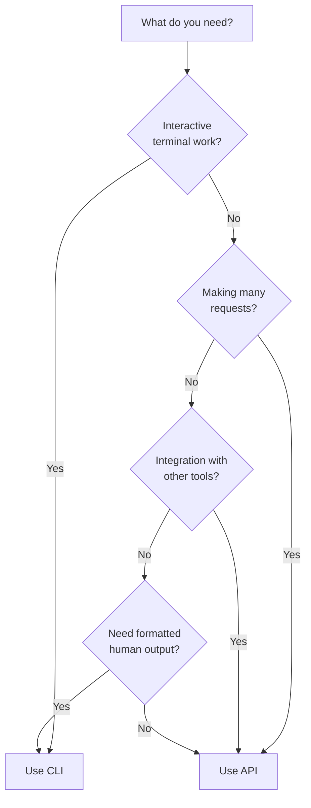

# CLI vs HTTP API: Which Should You Use?

Zen Bridge provides two interfaces to control your browser: a **Command-Line Interface (CLI)** and an **HTTP API**. Both use the same underlying code, but they're optimized for different use cases.

This guide will help you understand when to use each one.

## Quick Decision Guide



## At a Glance Comparison

| Feature | CLI | HTTP API |
|---------|-----|----------|
| **Speed (per request)** | ~430ms | ~60ms (7x faster) |
| **Startup time** | Every command | Once (stays running) |
| **Output format** | Human-friendly | JSON (machine-readable) |
| **Best for** | Interactive use | Automation & integration |
| **Learning curve** | Easier | Moderate |
| **Features** | Full (colors, prompts) | Core functionality |
| **Integration** | Shell scripts | Any language/tool |

## Performance Comparison

### The Numbers

Let's look at actual performance measurements:

```bash
# Single CLI command
time zen info
# Real time: ~430ms

# Single API request
time curl http://localhost:8767/api/extraction/info
# Real time: ~60ms

# 10 CLI commands
time for i in {1..10}; do zen info > /dev/null; done
# Real time: ~4.3 seconds (430ms each)

# 10 API requests
time for i in {1..10}; do curl -s http://localhost:8767/api/extraction/info > /dev/null; done
# Real time: ~0.6 seconds (60ms each)
```

**The API is ~7x faster for repeated requests!**

### Why The Difference?

#### CLI Overhead

When you run a CLI command, here's what happens:

```
┌─────────────────────────────────────────────┐
│ 1. Start Python interpreter         ~200ms │
│ 2. Import all modules                ~100ms │
│ 3. Parse command-line arguments       ~50ms │
│ 4. Check userscript version          ~100ms │ ⚠️
│ 5. Execute JavaScript in browser      ~50ms │
│ 6. Format output for terminal         ~20ms │
│ 7. Print with colors/formatting       ~10ms │
├─────────────────────────────────────────────┤
│ Total:                               ~530ms │
└─────────────────────────────────────────────┘
```

**Key points**:
- Python starts fresh every time
- Version check makes an extra HTTP request
- Formatting adds overhead
- But you get nice, human-readable output!

#### API Speed

When you call the API:

```
┌─────────────────────────────────────────────┐
│ 1. HTTP request to running server     ~5ms │
│ 2. FastAPI validates request           ~2ms │
│ 3. Execute JavaScript in browser      ~50ms │
│ 4. Return raw JSON                     ~3ms │
├─────────────────────────────────────────────┤
│ Total:                                ~60ms │
└─────────────────────────────────────────────┘
```

**Key points**:
- Server is already running (no startup)
- No version check on every request
- Minimal formatting overhead
- Returns raw JSON immediately

### Visualizing the Difference

Here's a visual representation of 10 requests:

**CLI (10 requests = 4.3 seconds)**:
```
Request 1: [■■■■■■■■■] 430ms
Request 2: [■■■■■■■■■] 430ms
Request 3: [■■■■■■■■■] 430ms
Request 4: [■■■■■■■■■] 430ms
Request 5: [■■■■■■■■■] 430ms
Request 6: [■■■■■■■■■] 430ms
Request 7: [■■■■■■■■■] 430ms
Request 8: [■■■■■■■■■] 430ms
Request 9: [■■■■■■■■■] 430ms
Request 10:[■■■■■■■■■] 430ms
```

**API (10 requests = 0.6 seconds)**:
```
Request 1: [■] 60ms
Request 2: [■] 60ms
Request 3: [■] 60ms
Request 4: [■] 60ms
Request 5: [■] 60ms
Request 6: [■] 60ms
Request 7: [■] 60ms
Request 8: [■] 60ms
Request 9: [■] 60ms
Request 10:[■] 60ms
```

## When to Use the CLI

### ✅ Perfect For:

#### 1. Interactive Terminal Work

When you're exploring a website manually:

```bash
# Open a page
zen open "https://example.com"

# Look at the page structure
zen outline

# Extract some data
zen links

# Get page info
zen info
```

**Why CLI is better**: Nice formatted output, colors, easy to read.

#### 2. One-Off Commands

Quick tasks you run occasionally:

```bash
# Take a screenshot
zen screenshot output.png

# Get a page summary
zen summarize

# Execute some JavaScript
zen eval "document.title"
```

**Why CLI is better**: No need to start a server, just run and done.

#### 3. Shell Scripts

Simple automation in bash/zsh scripts:

```bash
#!/bin/bash
# check-website.sh

zen open "https://mysite.com"
sleep 2

if zen eval "document.querySelector('.error')" >/dev/null 2>&1; then
    echo "❌ Error found on page"
    exit 1
else
    echo "✅ Page looks good"
fi
```

**Why CLI is better**: Integrates naturally with shell scripts, exit codes work well.

#### 4. Human-Readable Output

When you need output formatted for humans:

```bash
zen info
```

```
URL:      https://example.com
Title:    Example Domain
Domain:   example.com
Protocol: https:
State:    complete
Size:     1280x720

Zen Bridge: Extension v4.2.1
```

**Why CLI is better**: Output is formatted, colored, and easy to scan visually.

#### 5. Interactive Features

Commands that need user interaction:

```bash
# Control browser with keyboard
zen control

# Interactive REPL
zen repl

# Download with interactive selection
zen download
```

**Why CLI is better**: These features require terminal interaction, prompts, keyboard input.

### ❌ Not Ideal For:

- High-frequency requests (>10 per minute)
- Integration with web applications
- When you need raw JSON data
- Performance-critical automation
- Non-Python environments

## When to Use the HTTP API

### ✅ Perfect For:

#### 1. High-Frequency Automation

When making many requests in succession:

```python
import requests

session = requests.Session()
API = "http://localhost:8767"

# Fast: Reuses connection
for url in urls:
    session.post(f"{API}/api/navigation/open", json={"url": url})
    info = session.get(f"{API}/api/extraction/info").json()

    if "error" in info["result"]["title"]:
        alert_team(url)
```

**Why API is better**: 7x faster, reuses HTTP connection, no startup overhead.

#### 2. Web Application Integration

Building a web dashboard or service:

```javascript
// Frontend JavaScript
async function getPageInfo() {
    const response = await fetch('http://localhost:8767/api/extraction/info');
    const data = await response.json();

    document.getElementById('title').textContent = data.result.title;
    document.getElementById('url').textContent = data.result.url;
}

// Update every 2 seconds
setInterval(getPageInfo, 2000);
```

**Why API is better**: Native JSON, works from browser, modern web apps expect REST APIs.

#### 3. Microservice Architecture

Part of a larger system:

```yaml
# docker-compose.yml
services:
  zen-api:
    image: zen-bridge-api
    ports:
      - "8767:8767"

  monitor-service:
    image: website-monitor
    environment:
      - ZEN_API=http://zen-api:8767
```

**Why API is better**: Containers, service discovery, standard HTTP protocols.

#### 4. Cross-Language Integration

Using Zen Bridge from non-Python languages:

```javascript
// Node.js
const axios = require('axios');

async function checkPage(url) {
    await axios.post('http://localhost:8767/api/navigation/open', {
        url: url,
        wait: true
    });

    const info = await axios.get('http://localhost:8767/api/extraction/info');
    return info.data;
}
```

```ruby
# Ruby
require 'httparty'

response = HTTParty.post('http://localhost:8767/api/navigation/open',
    body: { url: 'https://example.com', wait: true }.to_json,
    headers: { 'Content-Type' => 'application/json' }
)
```

```go
// Go
package main

import (
    "bytes"
    "encoding/json"
    "net/http"
)

func navigate(url string) error {
    body, _ := json.Marshal(map[string]interface{}{
        "url": url,
        "wait": true,
    })

    _, err := http.Post(
        "http://localhost:8767/api/navigation/open",
        "application/json",
        bytes.NewBuffer(body),
    )
    return err
}
```

**Why API is better**: HTTP is universal, every language has HTTP clients.

#### 5. Monitoring & Alerting

Continuous monitoring systems:

```python
import requests
import time

API = "http://localhost:8767"

while True:
    # Navigate to page
    requests.post(f"{API}/api/navigation/open",
                  json={"url": "https://mysite.com"})

    # Check for errors
    result = requests.post(f"{API}/api/execution/eval",
                          json={"code": "document.querySelector('.error') !== null"})

    if result.json()["result"]:
        send_alert("Error detected on website!")

    time.sleep(60)  # Check every minute
```

**Why API is better**: Long-running process, efficient, can run 24/7.

#### 6. Machine-Readable Data

When you need JSON for processing:

```bash
# API returns clean JSON
curl http://localhost:8767/api/extraction/links | jq '.result[] | .href'
```

```json
{
  "ok": true,
  "result": [
    {"href": "https://example.com/1", "text": "Link 1"},
    {"href": "https://example.com/2", "text": "Link 2"}
  ]
}
```

**Why API is better**: JSON is easy to parse, process with jq, store in databases.

### ❌ Not Ideal For:

- Quick one-off tasks
- When you want human-readable output
- Interactive terminal features
- Learning Zen Bridge (CLI is more intuitive)

## Hybrid Approaches

You don't have to choose just one! Here are patterns that use both:

### Pattern 1: Development with CLI, Production with API

```bash
# During development - use CLI for exploration
zen open "https://example.com"
zen outline
zen info

# Once you know what you need, automate with API
curl http://localhost:8767/api/extraction/info > data.json
```

### Pattern 2: Shell Scripts with API for Performance

```bash
#!/bin/bash
# monitor.sh - Uses API for speed

API="http://localhost:8767"

# Fast: API calls
for url in $(cat urls.txt); do
    curl -s -X POST "$API/api/navigation/open" \
        -H "Content-Type: application/json" \
        -d "{\"url\":\"$url\"}"

    info=$(curl -s "$API/api/extraction/info")
    title=$(echo "$info" | jq -r '.result.title')
    echo "Checked: $title"
done

# Nice output: CLI for final report
echo "\nFull report:"
zen info --extended
```

### Pattern 3: CLI for Setup, API for Execution

```bash
# Use CLI to start servers
zen server start
uvicorn zen.app.api.server:app --host 127.0.0.1 --port 8767 &

# Use API for the heavy lifting
python automation_script.py  # Uses HTTP API

# Use CLI for final checks
zen info
zen screenshot final-state.png
```

## Performance Optimization Tips

### For CLI Users

If you need better CLI performance:

1. **Use `--json` flag** for faster output:
   ```bash
   zen info --json | jq
   ```

2. **Batch commands** in shell scripts:
   ```bash
   # Slower: Multiple commands
   zen eval "document.title"
   zen eval "document.URL"

   # Faster: One command
   zen eval "({title: document.title, url: document.URL})" --format json
   ```

3. **Keep bridge server running**:
   ```bash
   zen server start --daemon  # Only start once
   ```

### For API Users

To maximize API performance:

1. **Reuse HTTP connections**:
   ```python
   session = requests.Session()  # Reuse connection
   for _ in range(100):
       session.get("http://localhost:8767/api/extraction/info")
   ```

2. **Use connection pooling**:
   ```python
   from requests.adapters import HTTPAdapter
   from urllib3.util.retry import Retry

   session = requests.Session()
   adapter = HTTPAdapter(pool_connections=10, pool_maxsize=20)
   session.mount('http://', adapter)
   ```

3. **Batch requests** when possible:
   ```python
   # Instead of many small requests
   results = []
   for url in urls:
       # ... multiple API calls per URL

   # Better: Collect data, process in bulk
   data = session.get(f"{API}/api/extraction/info").json()
   process_batch(data)
   ```

## Real-World Examples

### Example 1: Daily Website Check (Use CLI)

```bash
#!/bin/bash
# daily-check.sh - Run once per day

zen open "https://mysite.com"
sleep 3

# Get summary
zen describe > summary.txt

# Take screenshot
zen screenshot website-$(date +%Y%m%d).png

# Email report
mail -s "Daily Website Check" admin@example.com < summary.txt
```

**Why CLI**: Runs once daily, human-readable output, simple script.

### Example 2: Real-Time Monitoring (Use API)

```python
# monitor.py - Runs continuously

import requests
import time
from datetime import datetime

API = "http://localhost:8767"
session = requests.Session()

while True:
    # Navigate
    session.post(f"{API}/api/navigation/open",
                 json={"url": "https://mysite.com", "wait": True})

    # Extract data
    info = session.get(f"{API}/api/extraction/info").json()

    # Log to database
    log_to_database({
        "timestamp": datetime.now(),
        "title": info["result"]["title"],
        "status": "ok" if info["ok"] else "error"
    })

    time.sleep(30)  # Check every 30 seconds
```

**Why API**: Continuous running, efficient, structured data.

### Example 3: Web Dashboard (Use API)

```html
<!DOCTYPE html>
<html>
<head>
    <title>Browser Monitor</title>
</head>
<body>
    <h1>Current Page: <span id="title"></span></h1>
    <p>URL: <span id="url"></span></p>
    <button onclick="refresh()">Refresh</button>

    <script>
    async function refresh() {
        const response = await fetch('http://localhost:8767/api/extraction/info');
        const data = await response.json();

        document.getElementById('title').textContent = data.result.title;
        document.getElementById('url').textContent = data.result.url;
    }

    // Auto-refresh every 5 seconds
    setInterval(refresh, 5000);
    refresh();
    </script>
</body>
</html>
```

**Why API**: Web integration, real-time updates, works in browser.

### Example 4: Data Collection Script (Use API)

```python
# collect-data.py - Efficient data collection

import requests
import csv

API = "http://localhost:8767"
session = requests.Session()

urls = ["https://site1.com", "https://site2.com", "https://site3.com"]
results = []

for url in urls:
    # Navigate
    session.post(f"{API}/api/navigation/open", json={"url": url, "wait": True})

    # Get info
    info = session.get(f"{API}/api/extraction/info").json()

    # Extract links
    links = session.get(f"{API}/api/extraction/links").json()

    results.append({
        "url": url,
        "title": info["result"]["title"],
        "link_count": len(links["result"])
    })

# Save to CSV
with open('results.csv', 'w') as f:
    writer = csv.DictWriter(f, fieldnames=['url', 'title', 'link_count'])
    writer.writeheader()
    writer.writerows(results)
```

**Why API**: Many requests, structured data, CSV export.

## Summary

### Use the **CLI** when you want:
- 🖥️ Interactive terminal work
- 👤 Human-readable output
- 🎨 Colors and formatting
- 🔧 Simple shell scripts
- 📖 Easy learning curve
- ⚡ Quick one-off commands

### Use the **HTTP API** when you need:
- ⚡ High performance (7x faster)
- 🔄 Many repeated requests
- 🌐 Integration with web apps
- 🤖 Machine-readable JSON
- 🔌 Cross-language support
- 📊 Continuous monitoring
- 🏗️ Microservices architecture

### The Best Part?

**Both use the same code!** When you add a new feature, it automatically works in both the CLI and the API. Choose the interface that fits your use case, and switch anytime without learning something completely new.

## Next Steps

- **Learn more about the CLI**: [Basic Commands Guide](basic-commands.md)
- **Explore the API**: [HTTP API Guide](../api/http-api.md)
- **See examples**: [Advanced Usage](advanced.md)

---

Still not sure which to use? **Start with the CLI** - it's easier to learn and perfect for exploration. Once you know what you need, switch to the API for production automation!
