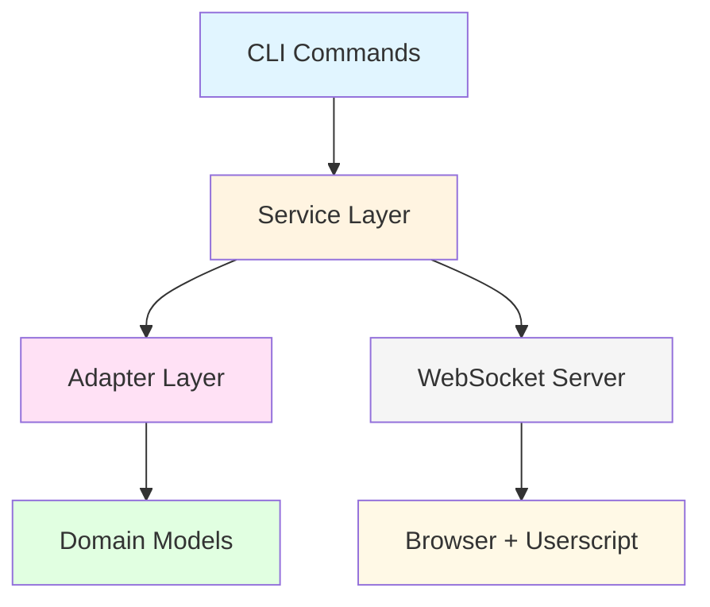

# Zen Browser Bridge

**Execute JavaScript in your browser from the command line.**

A powerful CLI tool for browser automation, debugging, and interactive development. Control your browser, extract data, automate tasks, and interact with web pages—all from your terminal.

---

## Overview

Zen Browser Bridge creates a WebSocket connection between your terminal and browser, enabling you to:

- Execute JavaScript code directly in any browser tab
- Extract data from authenticated sessions
- Automate repetitive browser tasks
- Debug web applications interactively
- Build custom workflows combining CLI tools with browser automation

```bash
# Execute JavaScript and get instant results
zen eval "document.title"
# => "Example Domain"

# Extract all links from a page
zen links --only-external --only-urls > external-links.txt

# Start an interactive JavaScript REPL
zen repl

# Control your browser with keyboard navigation
zen control
```

---

## Architecture Overview

Zen Bridge uses a clean 4-layer architecture to bridge your terminal and browser:



---

## Key Features

### :zap: Execute JavaScript

Run JavaScript code in your active browser tab from the terminal. Full access to the DOM, browser APIs, and page context.

```bash
zen eval "Array.from(document.querySelectorAll('h1, h2, h3')).map(h => h.textContent)"
```

### :keyboard: Interactive REPL

Live JavaScript experimentation with instant feedback. Perfect for exploring APIs, debugging, and prototyping.

```javascript
zen> document.querySelectorAll('a').length
42
zen> Array.from(document.links).slice(0, 3).map(a => a.href)
["https://example.com/page1", "https://example.com/page2", "https://example.com/page3"]
```

### :robot: AI Integration

Article summarization and page descriptions powered by AI. Requires [mods](https://github.com/charmbracelet/mods) to be installed.

```bash
zen summarize  # Concise article summary
zen describe   # Natural-language page description for screen readers
```

### :point_up_2: Element Interaction

Click, inspect, highlight, and wait for elements using CSS selectors.

```bash
zen click "button#submit"
zen highlight "h1, h2" --color blue
zen wait ".modal-dialog" --visible --timeout 10
```

### :control_knobs: Keyboard Control

Navigate pages entirely from your keyboard with auto-refocus across page loads.

```bash
zen control
# Tab → Enter → Page loads → Element auto-refocuses → Continue navigating
```

### :mag: Data Extraction

Extract links, images, tables, metadata, and more with built-in commands and custom scripts.

```bash
zen links --only-external --enrich-external  # Get external links with metadata
zen outline                                   # Display page heading hierarchy
zen info --extended                          # Extract comprehensive page info
```

### :floppy_disk: File Downloads

Interactive file finder and downloader for images, documents, videos, audio, and archives.

```bash
zen download  # Interactive selection
zen download --list  # List all downloadable files
```

### :eyes: Real-time Monitoring

Watch keyboard events and browser activity as they happen.

```bash
zen watch input  # Monitor keyboard input in real-time
```

---

## Quick Installation

### Requirements

- **Python 3.11 or higher**
- A modern browser (Chrome, Firefox, Edge, Safari, etc.)
- A userscript manager extension

### 1. Install the CLI

```bash
# Clone the repository
git clone https://github.com/roelvangils/zen-bridge.git
cd zen-bridge

# Install in development mode
pip install -e .
```

### 2. Install the Userscript

Install a userscript manager in your browser:

- [Violentmonkey](https://violentmonkey.github.io/) (recommended)
- [Tampermonkey](https://www.tampermonkey.net/)
- [Greasemonkey](https://www.greasespot.net/) (Firefox only)

Then copy the userscript content:

```bash
zen userscript  # Display the userscript code
```

Create a new userscript in your userscript manager and paste the code.

### 3. Start the Server

```bash
zen server start --daemon
```

That's it! You're ready to control your browser from the terminal.

:bulb: **Full installation guide**: [Getting Started → Installation](getting-started/installation.md)

---

## Quick Example

Here's a practical example showing the power of Zen Browser Bridge:

!!! example "Example: Extract External Links"
    **Command:**
    ```bash
    zen links --only-external --enrich-external
    ```

    **Output:**
    ```
    🔗 External Links (15 found)

    📄 GitHub Documentation
       https://docs.github.com/en
       Status: ✅ 200 OK

    📄 Python Official Site
       https://www.python.org
       Status: ✅ 200 OK

    📄 Stack Overflow Thread
       https://stackoverflow.com/questions/12345
       Status: ✅ 200 OK

    ✨ Total: 15 external links | ✅ 14 reachable | ❌ 1 error
    ```

=== "Extract External Links"

    ```bash
    # Navigate to a page in your browser, then:
    zen links --only-external --only-urls | sort | uniq > external-links.txt

    # Result: All unique external links saved to a file
    ```

=== "Form Automation"

    ```bash
    # Fill out a login form
    zen eval "document.querySelector('#email').value = 'user@example.com'"
    zen eval "document.querySelector('#password').value = 'secret'"
    zen click "button[type=submit]"

    # Wait for success message
    zen wait ".success-message" --visible
    ```

=== "Data Scraping"

    ```bash
    # Extract product information (while logged in)
    zen eval "
      Array.from(document.querySelectorAll('.product')).map(p => ({
        name: p.querySelector('.name').textContent,
        price: p.querySelector('.price').textContent,
        inStock: p.querySelector('.in-stock') !== null
      }))
    " --format json > products.json
    ```

=== "SEO Analysis"

    ```bash
    # Get page outline
    zen outline

    # Extract all metadata
    zen exec zen/scripts/extract_metadata.js --format json

    # Check external links status
    zen links --enrich-external --json
    ```

---

## What's New in v2.0

Zen Browser Bridge 2.0 brings major architectural improvements while maintaining full backward compatibility:

### :building_construction: Modular Architecture

Clean hexagonal design with 4 layers:

- **Domain Layer** - Pure business logic with Pydantic models
- **Adapter Layer** - I/O operations (filesystem, WebSocket)
- **Service Layer** - Application services and orchestration
- **Application Layer** - CLI commands and server

Benefits:

- High testability (97%+ coverage on core services)
- Clear dependencies (no circular imports)
- Easy extensibility (add new commands/services)
- Maintainable codebase (avg 362 lines per module)

### :test_tube: Comprehensive Testing

- **244 tests** with 97%+ coverage on core services
- Unit, integration, and E2E test suites
- CI/CD pipeline testing on Python 3.11-3.13
- Automated quality checks (linting, type checking)

### :rocket: Enhanced Performance

- Eliminated blocking I/O for faster responses
- Async file operations where appropriate
- Optimized WebSocket message handling

### :shield: Type Safety

- Full type hints throughout codebase
- Pydantic validation for all models
- Protocol validation for WebSocket messages
- MyPy type checking enforced

### :memo: Better Documentation

- Complete architecture documentation
- Security best practices guide
- Protocol specification
- Contributing guidelines

### :recycle: Zero Breaking Changes

Full backward compatibility with v1.x - upgrade seamlessly without changing your workflows.

---

## Next Steps

<div class="grid cards" markdown>

-   :rocket: __Quick Start__

    ---

    Get up and running in 5 minutes with a hands-on tutorial.

    [:octicons-arrow-right-24: Quick Start Guide](getting-started/quick-start.md)

-   :wrench: __Configuration__

    ---

    Customize Zen Bridge for your workflow with control mode, AI settings, and more.

    [:octicons-arrow-right-24: Configuration Guide](getting-started/configuration.md)

-   :books: __User Guide__

    ---

    Learn all commands, features, and advanced usage patterns.

    [:octicons-arrow-right-24: User Guide](guide/overview.md)

-   :hammer_and_wrench: __Development__

    ---

    Contribute to Zen Bridge or build custom extensions.

    [:octicons-arrow-right-24: Development Guide](development/architecture.md)

</div>

---

## Why Zen Browser Bridge?

### Traditional Browser Automation is Complex

Tools like Selenium and Playwright require:

- Heavy setup and dependencies
- Starting browser instances
- Managing browser drivers
- Learning complex APIs
- Writing verbose code

### Zen Bridge is Simple

Just install a userscript and start executing commands:

```bash
zen eval "document.title"
```

That's it. No browser drivers, no setup complexity, just instant browser control.

### Feature Comparison

See how Zen Bridge compares to traditional browser automation tools:

| Feature | Zen Bridge | Puppeteer | Selenium |
|---------|------------|-----------|----------|
| Setup Time | < 2 min | 10+ min | 15+ min |
| CLI Access | ✅ Yes | ❌ No | ❌ No |
| Real Browser | ✅ Yes | ✅ Yes | ✅ Yes |
| Interactive Mode | ✅ Yes | ❌ No | ❌ No |
| Works with Auth | ✅ Yes | ⚠️ Complex | ⚠️ Complex |
| Keyboard Control | ✅ Yes | ❌ No | ❌ No |
| Live REPL | ✅ Yes | ❌ No | ❌ No |
| Browser Drivers | ❌ None | ✅ Required | ✅ Required |
| Learning Curve | Low | Medium | High |

### Perfect for These Use Cases

- **Data Extraction** - Scrape data from authenticated sessions
- **Testing & Debugging** - Experiment with live pages interactively
- **Automation** - Automate repetitive browser tasks from scripts
- **Development** - Inspect app state and debug without DevTools
- **Accessibility** - Navigate pages with keyboard control mode
- **Research** - Analyze page structure, SEO, and performance

---

## Community & Support

- **GitHub Issues** - [Report bugs and request features](https://github.com/roelvangils/zen-bridge/issues)
- **GitHub Discussions** - [Ask questions and share workflows](https://github.com/roelvangils/zen-bridge/discussions)
- **Contributing** - [Development guide](development/contributing.md)

---

## License

Zen Browser Bridge is open source software released under the [MIT License](about/license.md).

Created by **Roel van Gils** - Inspired by the original KM JS Bridge concept.
